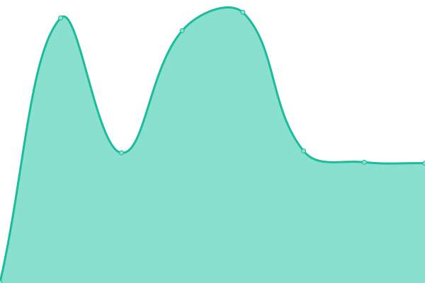
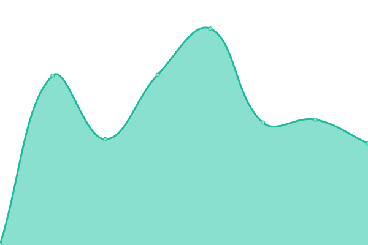

# [📈 Live Status](https://upptime.github.io/upptime): <!--live status--> **🟧 Partial outage**

This repository contains the open-source uptime monitor and status page for [Upptime](https://upptime.js.org), powered by [Upptime](https://github.com/upptime/upptime).

With [Upptime](https://upptime.js.org), you can get your own unlimited and free uptime monitor and status page, powered entirely by a GitHub repository. We use [Issues](https://github.com/upptime/upptime/issues) as incident reports, [Actions](https://github.com/loopcrypto/uptime/actions) as uptime monitors, and [Pages](https://upptime.github.io/upptime) for the status page.

<!--start: status pages-->
<!-- This summary is generated by Upptime (https://github.com/upptime/upptime) -->
<!-- Do not edit this manually, your changes will be overwritten -->
<!-- prettier-ignore -->
| URL | Status | History | Response Time | Uptime |
| --- | ------ | ------- | ------------- | ------ |
|  [Loop Website](http://loooo1.com/) | 🟥 Down | [loop-website.yml](https://github.com/LoopCrypto/uptime/commits/HEAD/history/loop-website.yml) | 

 0ms
     
 | 

<a href="https://loopcrypto.github.io/uptime/history/loop-website">0.00%</a>
    

|  [Company Dashboard](https://admin.loopcrypto.xyz) | 🟩 Up | [company-dashboard.yml](https://github.com/LoopCrypto/uptime/commits/HEAD/history/company-dashboard.yml) | 

 396ms
     
 | 

<a href="https://loopcrypto.github.io/uptime/history/company-dashboard">100.00%</a>
    

|  [Customer Dashboard](https://my.loopcrypto.xyz) | 🟩 Up | [customer-dashboard.yml](https://github.com/LoopCrypto/uptime/commits/HEAD/history/customer-dashboard.yml) | 

 361ms
     
 | 

<a href="https://loopcrypto.github.io/uptime/history/customer-dashboard">100.00%</a>
    

|  [Checkout](https://checkout.loopcrypto.xyz) | 🟩 Up | [checkout.yml](https://github.com/LoopCrypto/uptime/commits/HEAD/history/checkout.yml) | 

 367ms
     
 | 

<a href="https://loopcrypto.github.io/uptime/history/checkout">100.00%</a>
    

|  [Manage Dashboard](https://manage.loopcrypto.xyz) | 🟩 Up | [manage-dashboard.yml](https://github.com/LoopCrypto/uptime/commits/HEAD/history/manage-dashboard.yml) | 

 359ms
     
 | 

<a href="https://loopcrypto.github.io/uptime/history/manage-dashboard">100.00%</a>
    

|  [Loop Pay](https://pay.loopcrypto.xyz) | 🟩 Up | [loop-pay.yml](https://github.com/LoopCrypto/uptime/commits/HEAD/history/loop-pay.yml) | 

 378ms
     
 | 

<a href="https://loopcrypto.github.io/uptime/history/loop-pay">100.00%</a>
    

|  [Loop Invoice](https://invoice.loopcrypto.xyz) | 🟩 Up | [loop-invoice.yml](https://github.com/LoopCrypto/uptime/commits/HEAD/history/loop-invoice.yml) | 

 367ms
     
 | 

<a href="https://loopcrypto.github.io/uptime/history/loop-invoice">100.00%</a>
    

<!--end: status pages-->

[**Visit our status website →**](https://upptime.github.io/upptime)

## 📄 License

- Powered by: [Upptime](https://github.com/upptime/upptime)
- Code: [MIT](./LICENSE) © [Anand Chowdhary](https://anandchowdhary.com), supported by [Pabio](https://pabio.com)
- Data in the `./history` directory: [Open Database License](https://opendatacommons.org/licenses/odbl/1-0/)
